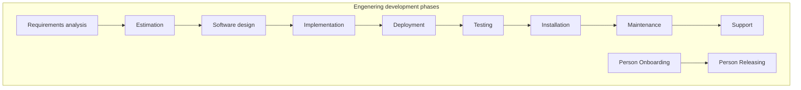

# Engenering Process Developing

Опишем процесс разработки на примере waterfall, так как по сути другие процессы разработки построенны на аналогичной базе. Например, путем добавления дополнительных итерационных шагов, возвратов на предыдущие этапы, комбинацией фаз.

**Development phases:**

**A. Requirements defenition:**
   - [Opportunity infrastructure setup](Opportunity-infrastructure.md);
   - [Requirements analysis](Requirements-analysis.md);
   - [Estimation](/Development-Process/Estimation.md);

**B. Design:**
   - [Project infrastructure setup](Project-infrastructure.md);
   - [Software design](Software-design.md);

**C. Implementation:**
   - [Development infrastructure setup](Development-infrastructure.md);
   - [Implementation](Implementation.md);
     - [Code Development](Implementation/Code-Development.md);
     - [Development infrastructure update](Development-infrastructure.md#Update);
     - [Continuous Deployment](Deployment.md);
   - [Testing](Testing.md);

**D. Delivery:**
   - [Delivery](Delivery.md);
   - [Maintenance](Maintenance.md);
   - [Support](Support.md);

**E. Person Involvement:**
   - [Person Onboarding](Onboarding.md);
   - [Person Releasing](Releasing.md);

---

**Appendix:**
* [Roles list](Roles.md);
* [Code Style](Code-Style.md);
* [Documents Examples](Documents-Examples.md);
* [Common practic](Common-practic.md);

    